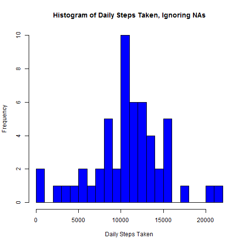
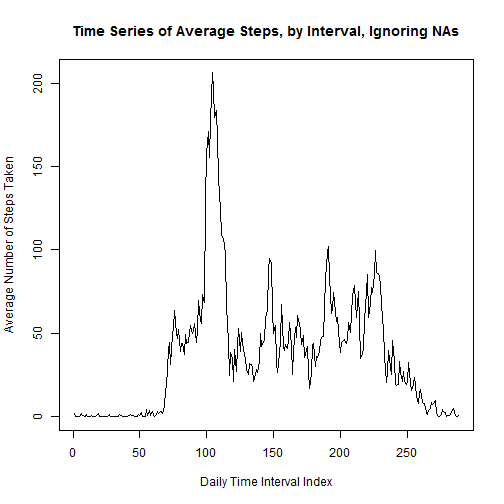
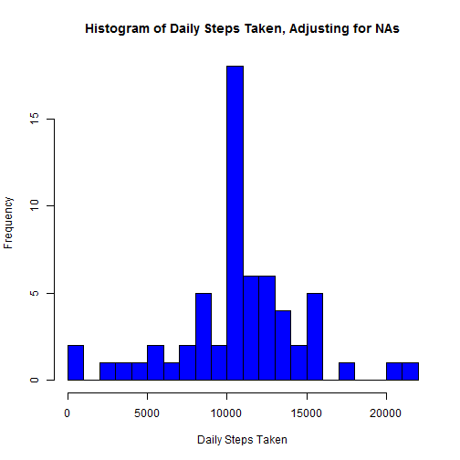

---
<<<<<<< HEAD
title: "Peer Assessment 1 - Chand Sooran"
author: "Chand Sooran"
date: "August 15, 2015"
output: html_document
---

## LOADING AND PROCESSING THE DATA

Show any code that is needed to 

1. Load the data
2. Process/transform the data (if necessary) into a format suitable for analysis

Here is the code I developed for loading the data and preparing to do the analysis


```r
## Set the working directory
olddir <- "C://Chand Sooran/Johns Hopkins/Reproducible Research/Assignment 1"
setwd(olddir)

## Set filenames to look for in the directory
filename1 <- "activity.csv"

## Load lattice library
library(lattice)
  
## Get the files and put them into the working directory
if(!file.exists(filename1)) {
  url1 <- "https://d396qusza40orc.cloudfront.net/repdata%2Fdata%2Factivity.zip"
  f <- file.path(getwd(), "Assignment1.zip")
  download.file(url1,f)
  unzip(zipfile = "Assignment1.zip")
  file.remove("Assignment1.zip")
}

## Read in the data from the csv file
RawData <- read.csv(file = "activity.csv")

## Set par properties
par(mfrow = c(1,1))
```

## WHAT IS THE MEAN TOTAL NUMBER OF STEPS TAKEN PER DAY?

For this part of the assignment, I ignored the missing values in the dataset.

1. Make a histogram of the total number of steps taken each day
2. Calculate and report the median and mean total number of steps taken each day


```r
## Calculate the number of days in the study
UniqueDays <- unique(RawData$date)
NumberOfDays <- length(UniqueDays)

## Calculate the number of intervals in any given day
NumberOfDailyIntervals <- 60 * 24 / 5

## Make a vector of new indices for a day's worth of intervals
IndexVector <- seq(from = 1, to = NumberOfDailyIntervals, by = 1)

## Make a new vector for all of the days
NewInterval <- NULL
for (i in 1:NumberOfDays) {NewInterval <- c(NewInterval, IndexVector)}

## Make a new dataframe using the constituents of RawData with correct index for intervals
IntervalData <- NULL
IntervalData <- data.frame(v1 = RawData$steps, v2 = RawData$date, v3 = NewInterval)
IntervalDataNames <- c("Steps", "Date", "Interval")
names(IntervalData) <- IntervalDataNames

## Make a new dataframe that takes IntervalData and ignores the missing values
IgnoreData <- na.omit(IntervalData)

## Calculate the number of days in the study after omitting missing values
UniqueIgnoreDays <- unique(IgnoreData$Date)
NumberOfIgnoreDays <- length(UniqueIgnoreDays)

## Calculate the total number of steps for all the days
IgnoreDailyFrame <- NULL
IgnoreDailySteps <- NULL
IgnoreDailyStepsVector <- NULL
for (i in UniqueIgnoreDays) {
  IgnoreDailyFrame <- IgnoreData[which(IgnoreData$Date == i),] ## Subset the data frame for the individual day
  IgnoreDailySteps <- sum(IgnoreDailyFrame$Steps) ## Calculate the total number of steps for the individual day
  IgnoreDailyStepsVector <- c(IgnoreDailyStepsVector, IgnoreDailySteps) ## Tack it on to the vector of daily values
}

## Make a histogram of the total number of steps taken per day
hist(IgnoreDailyStepsVector, col = "blue", breaks = 25, 
     main = "Histogram of Daily Steps Taken, Ignoring NAs",
     xlab = "Daily Steps Taken")
```

 

```r
## Calculate and report the mean # of steps taken per day
IgnoreMeanSteps <- mean(IgnoreDailyStepsVector)

## Calculate and report the median # of steps taken per day
IgnoreMedianSteps <- median(IgnoreDailyStepsVector)
```

**The mean number of daily steps taken (ignoring missing values) is 1.0766189 &times; 10<sup>4</sup>.**

**The median number of daily steps take (ignoring missing values) is 10765.**

## WHAT IS THE AVERAGE DAILY ACTIVITY PATTERN?

1. Make a time series plot of the 5-minute interval (x-axis) and the average number of steps taken, averaged across all the days (y-axis)
2. Which 5-minute interval, on average across all the days in the dataset, contains the maximum number of steps?


```r
## Subset the data frame by interval, calculate the mean steps for each interval, assemble mean vector
IntervalFactor <- as.factor(IndexVector) ## For subsetting
IgnoreIntervalFrame <- NULL
IgnoreIntervalMeanSteps <- NULL
IgnoreIntervalMeanVector <- NULL
for (i in IntervalFactor){
  IgnoreIntervalFrame <- IgnoreData[which(IgnoreData$Interval == i),] ## Subset the data frame by interval
  IgnoreIntervalMeanSteps <- mean(IgnoreIntervalFrame$Steps) ## Calculate the mean steps for the individual interval
  IgnoreIntervalMeanVector <- c(IgnoreIntervalMeanVector, IgnoreIntervalMeanSteps) ## Paste it to total vector
}

## Make the data frame for the mean steps by interval
IgnoreIntervalSummary <- cbind(IndexVector, IgnoreIntervalMeanVector)
IgnoreInterval <- as.data.frame(IgnoreIntervalSummary)
names(IgnoreInterval) <- c("Interval", "Steps")

## Make the time-series plot of interval on x-axis and average steps taken on y-axis
plot(IgnoreInterval$Interval,IgnoreInterval$Steps, 
     main = "Time Series of Average Steps, by Interval, Ignoring NAs",
     type = "l",
     xlab = "Daily Time Interval Index",
     ylab = "Average Number of Steps Taken")
```

 

```r
## Sort the data frame for the mean steps by interval in descending order
IgnoreIntervalDescending <- IgnoreInterval[order(IgnoreInterval$Steps, decreasing = TRUE),]

## Report the index number for the interval with the highest number of average steps
HighestIgnoreInterval <- IgnoreIntervalDescending[1,1]
```

**The 5-minute interval, on average across all the days in the dataset, ignoring NAs with the highest 
value is 104.**

## IMPUTING MISSING VALUES
Note that the existence of missing values may distort the analysis.

1. Calculate and report the total number of missing values in the dataset.
2. Devise a strategy for filling in all of the missing values.
3. Create a new dataset that is equal to the original dataset but with the missing values filled in.
4. Make a histogram of the total number of steps taken each day, and calculate and report the mean and median total number of steps taken per day.  Do these values differ from the estimates from the first part of the assignment?  What is the impact of imputing missing data on the estimates of the total daily number of steps?


```r
## Calculate and report the number of missing values
NumberMissingValues <- sum(is.na(RawData$steps))
```

**THe total number of missing values in the dataset is 2304.**

To fill in the missing values, I will assign the average value for the interval calculated in the earlier exercise.  So, I have chopped the day into 288 intervals and indexed them from 1 to 288.  For any day, where there is a missing value for interval j, I will substitute the value of the mean of the intervals across days from the days in which there is a non-NA value for that interval j.

Here, I have created a new dataset that is equal to the original dataset but with the missing values filled in.


```r
## Fill in the missing values for the dataset with the mean for the associated interval from above analysis
NOBS <- length(IntervalData$Steps)
TestNA <- is.na(IntervalData$Steps)
StepsData <- NULL
for (i in 1:NOBS) {
  Index <- IntervalData$Interval[i] 
  FitDataDate <- IntervalData$Date[i]
  FitDataInterval <- Index
  if(TestNA[i] == TRUE) {
    FitDataSteps <- IgnoreIntervalMeanVector[Index]
    StepsData <- c(StepsData, FitDataSteps)
  } else {
    FitDataSteps <- IntervalData$Steps[i]
    StepsData <- c(StepsData,FitDataSteps)
  }
}

## Make new data frame with imputed data for missing Steps data
FitData <- data.frame(v1 = StepsData, v2 = IntervalData$Date, v3 = IntervalData$Interval)
FitDataNames <- c("Steps","Date","Interval")
names(FitData) <- FitDataNames
```

Here is the histogram of the total number of steps taken each day, with this new dataset including imputed values for those instances where previously there had been an NA.


```r
## Calculate the number of days in the study after adjusting for missing values
UniqueFitDays <- unique(FitData$Date)
NumberOfFitDays <- length(UniqueFitDays)

## Calculate the total number of steps for each day
FitDailyFrame <- NULL
FitDailySteps <- NULL
FitDailyStepsVector <- NULL
for (i in UniqueFitDays) {
  FitDailyFrame <- FitData[which(FitData$Date == i),] ## Subset the data frame for the individual day
  FitDailySteps <- sum(FitDailyFrame$Steps) ## Calculate the total number of steps for the individual day
  FitDailyStepsVector <- c(FitDailyStepsVector, FitDailySteps) ## Tack it on to the vector of daily values
}

## Make a histogram of the total number of steps taken per day
hist(FitDailyStepsVector, col = "blue", breaks = 25, 
     main = "Histogram of Daily Steps Taken, Adjusting for NAs",
     xlab = "Daily Steps Taken")
```

 

Here is the code for the calculation of the mean and the median total number of steps taken each day.


```r
## Calculate and report the mean # of steps taken per day
FitMeanSteps <- mean(FitDailyStepsVector)

## Calculate and report the median # of steps taken per day
FitMedianSteps <- median(FitDailyStepsVector)
```

**The mean total number of steps taken each day, after adjusting for the missing values by substituting the** **average steps taken in intervals with missing data, is ``1.0766189 &times; 10<sup>4</sup>``.**

**The median total number of steps taken each day, after adjusting for the missing values by substituting the**
**average steps taken in intervals with missing data, is ``1.0766189 &times; 10<sup>4</sup>``.**

**There was no impact on the calculated value of the mean and a negligible impact on the calculated**
**value of the median because I used the mean by interval to impute the missing data and this served**
**to anchor the calculation.**

## ARE THERE DIFFERENCES IN ACTIVITY PATTERNS BEETWEEN WEEKDAYS AND WEEKENDS?

Use the dataset with the filled-in missing values for this part.

1. Create a new factor variable in the dataset with two levels - "weekday" and "weekend" indicating whether
a given day is a weekday or weekend day.
2. Make a panel plot containing a time series plot of the 5-minute interval (x-axis) and the average number
of steps taken, averaged across all weekday days or weekend days (y-axis).


```r
## Calculate the days of the week for the dates in the adjusted data set
FitDates <- as.POSIXct(FitData$Date)
FitDatesWeekDay <- weekdays(FitDates)

## Define Weekdays and weekends
WeekDayList <- c("Monday", "Tuesday", "Wednesday", "Thursday", "Friday")
WeekendList <- c("Saturday", "Sunday")

## Update the data frame to include the days of the week
UpdatedFitData <- NULL
UpdatedFitData <- cbind(FitData, FitDatesWeekDay)
names(UpdatedFitData) <- c(FitDataNames,"DayOfWeek")

## Subset the data frame into weekdays and weekends
WeekdayUpdatedFitData <- UpdatedFitData  
WeekdayUpdatedFitData <- WeekdayUpdatedFitData[WeekdayUpdatedFitData$DayOfWeek %in% WeekDayList,]
WeekendUpdatedFitData <- UpdatedFitData 
WeekendUpdatedFitData <- WeekendUpdatedFitData[WeekendUpdatedFitData$DayOfWeek %in% WeekendList,]

## Subset the Weekday data frame by interval, calculate mean steps for each interval, assemble mean vector
WeekdayIntervalFactor <- as.factor(IndexVector) ## For subsetting by Interval
WeekdayIntervalFrame <- NULL
WeekdayIntervalMeanSteps <- NULL
WeekdayIntervalMeanVector <- NULL
for (i in WeekdayIntervalFactor) {
  WeekdayIntervalFrame <- WeekdayUpdatedFitData[which(WeekdayUpdatedFitData$Interval == i),] ## Subset by interval
  WeekdayIntervalMeanSteps <- mean(WeekdayIntervalFrame$Steps) ## Calculate mean frame for the interval
  WeekdayIntervalMeanVector <- c(WeekdayIntervalMeanVector, WeekdayIntervalMeanSteps) ## Add to tally
}

## Make the matrix for the mean steps by Weekday interval
WeekdayIntervalSummary <- cbind(IndexVector, WeekdayIntervalMeanVector)
WeekdayInterval <- as.data.frame(WeekdayIntervalSummary)
names(WeekdayInterval) <- c("Interval", "Steps")

## Subset the weekend data frame by interval, calculate mean steps for each interval, assemble mean vector
WeekendIntervalFactor <- as.factor(IndexVector) ## For subsetting by interval
WeekendIntervalFrame <- NULL
WeekendIntervalMeanSteps <- NULL
WeekendIntervalMeanVector <- NULL
for (i in WeekendIntervalFactor) {
  WeekendIntervalFrame <- WeekendUpdatedFitData[which(WeekendUpdatedFitData$Interval == i),] ## Subset by interval
  WeekendIntervalMeanSteps <- mean(WeekendIntervalFrame$Steps) ## Calculate the mean frame for the interval
  WeekendIntervalMeanVector <- c(WeekendIntervalMeanVector, WeekendIntervalMeanSteps) ## Add to tally
}

## Make the matrix for the mean steps by weekend interval
WeekendIntervalSummary <- cbind(IndexVector, WeekendIntervalMeanVector)
WeekendInterval <- as.data.frame(WeekendIntervalSummary)
names(WeekendInterval) <- c("Interval", "Steps")

## Make a vector with the label "Weekday"
WeekdayLabel <- rep("Weekday", each = NumberOfDailyIntervals)
WeekdayLabel <- as.factor(WeekdayLabel)

## Make a vector with the label "Weekend"
WeekendLabel <- rep("Weekend", each = NumberOfDailyIntervals)
WeekendLabel <- as.factor(WeekendLabel)

## Make matrix for plots of Weekday and Weekend comparison
WeekdayInterval <- cbind(WeekdayInterval, WeekdayLabel)
names(WeekdayInterval) <- c("Interval", "Steps", "Day")
WeekendInterval <- cbind(WeekendInterval, WeekendLabel)
names(WeekendInterval) <- c("Interval", "Steps", "Day")

## Make matrix rejoining Weekday and Weekend matrices
TotalInterval <- rbind(WeekdayInterval, WeekendInterval)

## Make chart comparing average daily steps by interval for Weekend and Weekday
p <- xyplot(Steps ~ Interval | Day, data = TotalInterval, layout = c(1,2), type = "l", ylab = "Number of Steps")
print(p)
```

 


=======
title: "Reproducible Research: Peer Assessment 1"
output: 
  html_document:
    keep_md: true
---


## Loading and preprocessing the data


## What is mean total number of steps taken per day?


## What is the average daily activity pattern?


## Imputing missing values


## Are there differences in activity patterns between weekdays and weekends?
>>>>>>> 80edf39c3bb508fee88e3394542f967dd3fd3270
